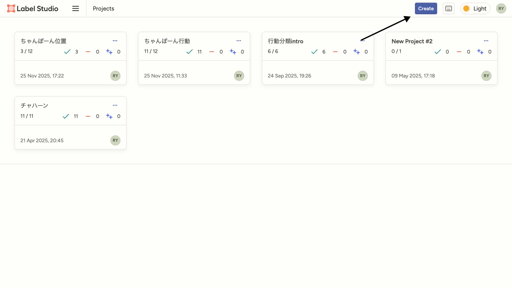
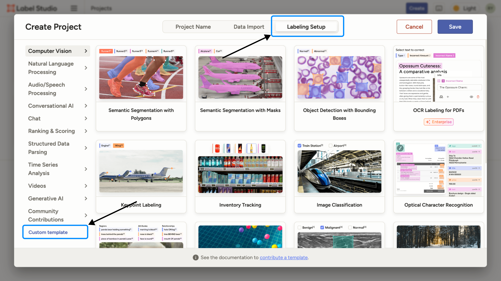
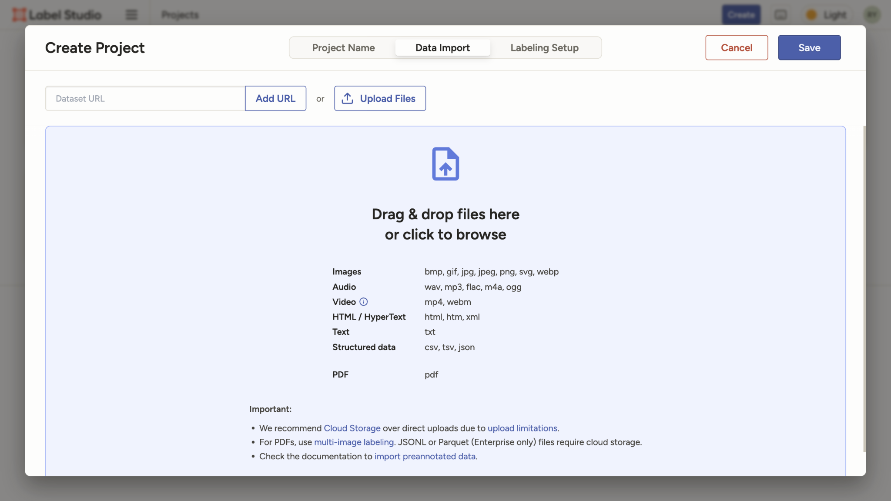

# Label Studio for Jenga Sensing
ジェンガセンシングのラベリング用リポジトリ

# セットアップ
## Python
venv 環境の構築
```shell
python -m venv .venv
```

インタープリターの設定
VSCode上で `Command / Ctrl + shift + p` を押して `>Python: インタープリターを選択` を選択．
`.venv (3.xx) ./.venv/bin/python` を選択．

VSCode上のターミナルを起動しなおし，`(.venv)` がついているのを確認する．

依存関係をインストール
```shell
pip install -r requirements.txt
```

## Label Studio
`Create` を押下．


`Project Name` `Description` は任意で設定する．

`Labeling Setup` タブを選択し，`Custom Template` を押下．


 をコード欄に入力．

`Data Import` タブを選択し，ラベリング対象となる `data/*.json` を全てドラッグドロップする．


`Save` を押下．
後はいい感じに．


# 実行
## Label Studio の起動
```shell
python ./scripts/run.py
```
起動前にラベリングデータが生成されます．
すでにファイルが存在する場合はスキップされます．
- data/[parent_folder]/[child_folder]/[]...]/heartbeat_converted.csv
- data/[parent_folder]-[child_folder]-[...].json

その後，Label Studio とデータ配信用 Flask サーバが起動されます．

## ラベリングデータの生成
強制的に再生成されます．

```shell
python ./scripts/prepare_labeling_data.py
```
